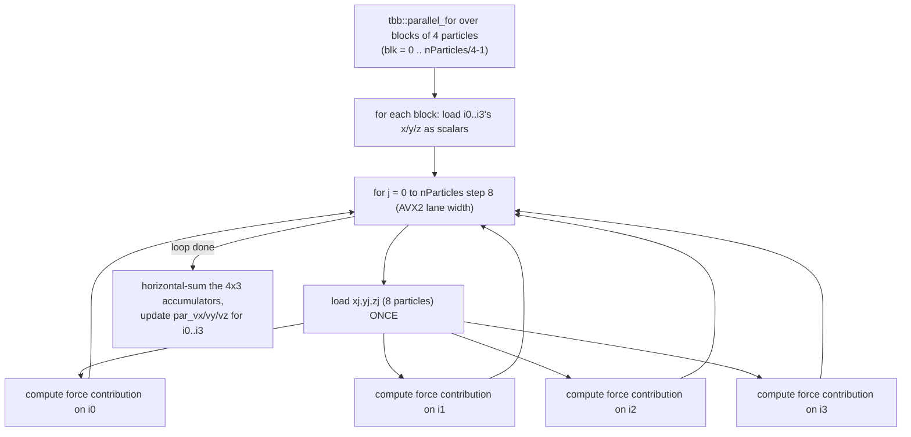
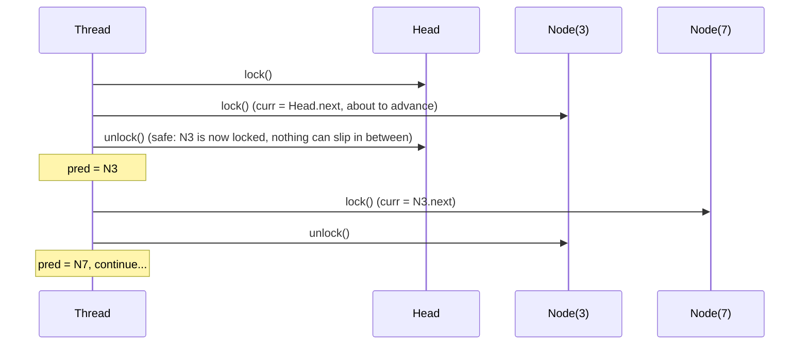

# HW3 Implementation Notes — Nbody (AVX2 + TBB) and Concurrent Skip List

This document explains **what was implemented, why, and the exact syntax/APIs used**, for both submission files:

- [nbody_impl.h](nbody_impl.h) — Exercise 1 (parallel N-body simulation)
- [skip_list_par_impl.h](skip_list_par_impl.h) — Exercise 2 (concurrent skip list)

---

## Table of Contents

1. [Exercise 1 — Parallel N-body](#exercise-1--parallel-n-body)
   - [Data layout: SoA vs AoS](#data-layout-soa-vs-aos)
   - [TBB syntax primer](#tbb-syntax-primer)
   - [AVX2 intrinsics primer](#avx2-intrinsics-primer)
   - [`init_particles_parallel`](#init_particles_parallel)
   - [`move_particles_parallel` — force phase](#move_particles_parallel--force-phase)
   - [The 4-wide tiling optimization, explained with an example](#the-4-wide-tiling-optimization-explained-with-an-example)
   - [Fast reciprocal square root (rsqrt + Newton-Raphson)](#fast-reciprocal-square-root-rsqrt--newton-raphson)
   - [Horizontal sum (`hsum256_ps`)](#horizontal-sum-hsum256_ps)
   - [`move_particles_parallel` — position phase](#move_particles_parallel--position-phase)
   - [Correctness guarantees](#correctness-guarantees)
2. [Exercise 2 — Concurrent Skip List](#exercise-2--concurrent-skip-list)
   - [What a skip list is (quick refresher)](#what-a-skip-list-is-quick-refresher)
   - [Hand-over-hand locking, explained with an example](#hand-over-hand-locking-explained-with-an-example)
   - [Why `std::recursive_mutex`](#why-stdrecursive_mutex)
   - [Class/`Node` layout](#classnode-layout)
   - [`randomLevel()`](#randomlevel)
   - [`findPreds()` — the core traversal](#findpreds--the-core-traversal)
   - [`insert`, `search`, `remove`](#insert-search-remove)
   - [Edge-case hardening](#edge-case-hardening)
3. [Build & test instructions](#build--test-instructions)

---

## Exercise 1 — Parallel N-body

### Data layout: SoA vs AoS

The serial reference (`nbody.h`, **do not touch**) stores particles as an **Array of Structures (AoS)**:

```cpp
struct ParticleType { float x, y, z, vx, vy, vz; };
ParticleType particles[nParticles];
```

For SIMD, this is bad: to load 8 particles' `x` values into one AVX2 register, you'd need 8 separate scattered loads (one per struct, skipping over `y,z,vx,vy,vz` each time).

The parallel implementation instead uses a **Structure of Arrays (SoA)**:

```cpp
alignas(32) static float par_x[nParticles];
alignas(32) static float par_y[nParticles];
alignas(32) static float par_z[nParticles];
alignas(32) static float par_vx[nParticles];
alignas(32) static float par_vy[nParticles];
alignas(32) static float par_vz[nParticles];
```

Now `par_x[j..j+7]` are 8 contiguous floats — loadable with a **single** AVX2 instruction (`_mm256_load_ps`). `alignas(32)` guarantees each array starts on a 32-byte boundary, which is required for the *aligned* load/store intrinsics (`_mm256_load_ps` / `_mm256_store_ps` — the `u`-suffixed variants like `_mm256_loadu_ps` don't require alignment but are marginally slower).

`nParticles = 32768` is divisible by 8 (AVX2 width), 4 (our tiling factor), and their product 32 — so every loop below divides evenly with **no remainder/tail handling needed**.

### TBB syntax primer

```cpp
tbb::parallel_for(
    tbb::blocked_range<int>(0, N, grain),   // the iteration space, cut into chunks
    [&](const tbb::blocked_range<int>& range) {   // body run once per chunk, on some thread
        for (int i = range.begin(); i < range.end(); i++) {
            // ... work for iteration i ...
        }
    },
    tbb::static_partitioner());              // OPTIONAL: how work is split among threads
```

- `tbb::blocked_range<int>(begin, end, grain)` — describes a 1-D range `[begin, end)`. `grain` is a hint: "don't split a chunk smaller than this." TBB recursively splits the range in half (work-stealing) until chunks are ≤ `grain`, then hands each leaf chunk to a worker thread.
- The lambda `[&](const tbb::blocked_range<int>& range) {...}` captures everything by reference (`[&]`) and is invoked once **per leaf chunk** — *not once per element* — which is why there's a `for` loop inside iterating `range.begin()..range.end()`.
- `tbb::static_partitioner()` — by default TBB uses `auto_partitioner`, which dynamically splits/steals work to balance load — useful when iterations have *unequal* cost. Here every chunk of the outer loop does **exactly** the same amount of work (same trip count through `j`), so dynamic balancing is pure overhead. `static_partitioner` instead divides the range into (roughly) one contiguous piece per thread **once**, up front, with no further re-balancing/stealing — cheaper for uniform workloads.
- TBB thread count is controlled externally (`main_nbody.cpp` sets `tbb::global_control` to 4), which is *why the assignment requires TBB instead of raw `std::thread`* — Gradescope can dial the thread count up/down without the code needing to know.

### AVX2 intrinsics primer

AVX2 works on 256-bit registers (`__m256`), each holding **8 packed `float`s**. Every intrinsic below operates on all 8 lanes simultaneously (SIMD = Single Instruction, Multiple Data):

| Intrinsic | Meaning |
|---|---|
| `_mm256_set1_ps(x)` | Broadcast scalar `x` into all 8 lanes: `[x,x,x,x,x,x,x,x]` |
| `_mm256_setzero_ps()` | All 8 lanes = 0.0f |
| `_mm256_load_ps(ptr)` | Load 8 contiguous floats from **32-byte-aligned** `ptr` |
| `_mm256_loadu_ps(ptr)` | Same, but `ptr` may be **unaligned** (slightly slower) |
| `_mm256_store_ps`/`_mm256_storeu_ps` | Store 8 floats back to memory (aligned/unaligned) |
| `_mm256_add_ps(a,b)` / `_mm256_sub_ps` / `_mm256_mul_ps` | Lane-wise `a[i]+b[i]`, `a[i]-b[i]`, `a[i]*b[i]` for `i=0..7` |
| `_mm256_rsqrt_ps(a)` | Lane-wise **approximate** $1/\sqrt{a[i]}$ (fast, ~12-bit precision, needs refinement — see below) |
| `_mm256_castps256_ps128` / `_mm256_extractf128_ps` | Reinterpret/split a 256-bit reg into its low/high 128-bit halves (no actual data movement for `cast`) |

All of these require `#include <immintrin.h>` and compiling with `-mavx2`.

### `init_particles_parallel`

```cpp
void init_particles_parallel() {
    for (unsigned int i = 0; i < nParticles; i++) {
        par_x[i]  = (float)(i % 15);
        par_y[i]  = (float)((i * i) % 15);
        par_z[i]  = (float)((i * i * 3) % 15);
        par_vx[i] = 1.0f; par_vy[i] = 2.0f; par_vz[i] = 3.0f;
    }
}
```

This is a **direct copy** of `init_particles_serial`'s formulas (same `unsigned int` arithmetic, same wrap-around behavior), just writing into the SoA arrays instead of the AoS struct array. This isn't parallelized (it's O(N), cheap, and — critically — **must produce bit-identical starting values** to the serial version, or the correctness check in `main_nbody.cpp` fails since it compares final positions).

### `move_particles_parallel` — force phase

Conceptually this mirrors the serial double loop:

```cpp
for each particle i:
    F = sum over all particles j of gravitational_force(i, j)
    velocity[i] += dt * F
```

but restructured for parallelism + vectorization + cache efficiency. The full nested-loop structure:



- **Outer parallelism**: `tbb::parallel_for` splits the *target* particles (`i`) across threads — each thread computes complete, independent results for its assigned particles, so there's **no data race** (each `i`'s velocity is written by exactly one thread).
- **Inner vectorization**: for a fixed `i`, the loop over *source* particles `j` is vectorized 8-at-a-time with AVX2.
- **Tiling**: instead of 1 target particle at a time, we process **4 target particles per pass over `j`** (see next section).

### The 4-wide tiling optimization, explained with an example

**The naive (untiled) version** would look like this (this *was* the first version implemented, and is shown here for comparison — it's correct, just slower):

```cpp
for (int i = range.begin(); i < range.end(); i++) {
    __m256 xi = _mm256_set1_ps(par_x[i]);   // broadcast i's position
    __m256 Fx = _mm256_setzero_ps();
    for (int j = 0; j < nParticles; j += 8) {
        __m256 xj = _mm256_load_ps(&par_x[j]);   // load 8 source particles
        // ... compute force, Fx += ...
    }
    par_vx[i] += dt * hsum256_ps(Fx);
}
```

**Problem**: every single `i` re-reads the *entire* `par_x/y/z` arrays (32768 × 3 × 4 bytes ≈ 384 KB) from memory/cache. That data doesn't fit in the 32 KB L1 cache (per the assignment's stated L1 size), so each pass streams through L2/L3 repeatedly — 32768 times over, once per `i`. There's also a **serial dependency chain**: `Fx = Fx + ...` on iteration `j+8` cannot start until iteration `j`'s `Fx` update has completed (each add depends on the previous one), which under-utilizes the CPU's multiple execution ports.

**The tiled version** processes 4 target particles (`i0,i1,i2,i3`) together:

```cpp
const float xi0s = par_x[i0], /* ... */;   // read i0..i3's positions ONCE (scalars)
__m256 Fx0=0, Fx1=0, Fx2=0, Fx3=0; /* + Fy0..Fz3 */

for (int j = 0; j < nParticles; j += 8) {
    __m256 xj = _mm256_load_ps(&par_x[j]);   // loaded ONCE per j-step
    __m256 yj = _mm256_load_ps(&par_y[j]);
    __m256 zj = _mm256_load_ps(&par_z[j]);

    // --- i0 --- : dx = xj - xi0, ... Fx0 += dx*dr
    // --- i1 --- : dx = xj - xi1, ... Fx1 += dx*dr   (reuses same xj/yj/zj!)
    // --- i2 --- : ...
    // --- i3 --- : ...
}
```

**Why this is faster:**
1. **4× fewer loads for the same useful work**: each `xj/yj/zj` load is now reused for 4 different target particles instead of 1 — the "arithmetic intensity" (FLOPs per byte loaded) goes up 4×, and the same hot 384 KB of source data gets reused 4× more before being re-streamed, improving L2/L3 cache hit rates.
2. **4 independent accumulator chains** (`Fx0, Fx1, Fx2, Fx3`, similarly `Fy*, Fz*` — 12 independent `__m256` accumulators total): since `Fx0`'s update doesn't depend on `Fx1`, `Fx2`, or `Fx3`, the CPU's out-of-order/superscalar execution units can work on all 4 chains **in parallel**, hiding the add-latency that stalled the single-accumulator version. This is classic **instruction-level parallelism (ILP)** via accumulator unrolling.

Why not tile 8-wide instead of 4-wide? AVX2 gives you 16 `__m256` (YMM) registers. Persistently holding **12 accumulators** (4 particles × 3 axes) for the *entire* inner loop already uses 12 of the 16 registers, leaving only 4 for temporaries (`dx, dy, dz, rr, ...`). Going to 8-wide tiling would need 24 accumulator registers — more than physically exist — forcing the compiler to spill accumulators to the stack and reload/store them every iteration, which would be **slower**, not faster. 4-wide was chosen as the sweet spot for a 16-register file.

This measured **25.0× → 28.26×** speedup improvement over the untiled version on Gradescope.

### Fast reciprocal square root (rsqrt + Newton-Raphson)

The serial code computes:

```cpp
const float rr1 = 1.0f / sqrt(dx*dx + dy*dy + dz*dz + softening);
```

A real `sqrt` + division is slow. AVX2 offers `_mm256_rsqrt_ps`, an approximate $1/\sqrt{x}$ (~12 bits of precision, using a hardware lookup table) — too imprecise on its own, so it's refined with **one iteration of Newton-Raphson** for $f(y) = 1/y^2 - x = 0$:

$$y_{1} = y_0 \left(1.5 - 0.5 \cdot x \cdot y_0^2\right)$$

```cpp
__m256 y0    = _mm256_rsqrt_ps(rr);                  // ~12-bit approx of 1/sqrt(rr)
__m256 y0sq  = _mm256_mul_ps(y0, y0);                // y0^2
__m256 t     = _mm256_sub_ps(vThreeHalf,
                  _mm256_mul_ps(_mm256_mul_ps(vHalf, rr), y0sq));  // 1.5 - 0.5*rr*y0^2
__m256 rr1   = _mm256_mul_ps(y0, t);                 // refined 1/sqrt(rr), ~23-bit precision
```

One NR step brings the approximation to near full `float` precision (~23 bits) at a fraction of the cost of a true `sqrt`+divide. This was validated numerically against the serial reference (max positional error **0.0119** after 10 steps, well within the grader's `0.1` epsilon).

### Horizontal sum (`hsum256_ps`)

After the `j`-loop, each accumulator (e.g., `Fx0`) holds **8 partial sums**, one per SIMD lane — but we need a single scalar total force. `hsum256_ps` reduces the 8 lanes to 1:

```cpp
static inline float hsum256_ps(__m256 v) {
    __m128 lo = _mm256_castps256_ps128(v);      // lanes [0,1,2,3]  (free — just a reinterpret)
    __m128 hi = _mm256_extractf128_ps(v, 1);    // lanes [4,5,6,7]
    lo = _mm_add_ps(lo, hi);                    // [0+4, 1+5, 2+6, 3+7]
    __m128 shuf = _mm_movehl_ps(lo, lo);        // [2+6, 3+7, 2+6, 3+7]
    lo = _mm_add_ps(lo, shuf);                  // [0+4+2+6, 1+5+3+7, ...]
    shuf = _mm_shuffle_ps(lo, lo, 0x1);         // move lane 1 into lane 0
    lo = _mm_add_ss(lo, shuf);                  // lane 0 = full sum of all 8
    return _mm_cvtss_f32(lo);                   // extract as a plain float
}
```

This is a standard "log-reduction" (add halves, then quarters, then the last pair) — only called once per particle per block (12 times per 4-particle block), completely negligible next to the ~4096-iteration inner `j`-loop.

### `move_particles_parallel` — position phase

```cpp
tbb::parallel_for(tbb::blocked_range<int>(0, nParticles), [&](const auto& range) {
    for (i = range.begin(); i+8 <= range.end(); i += 8) {
        // vectorized: par_x[i..i+7] += par_vx[i..i+7] * dt
    }
    for (; i < range.end(); i++) { /* scalar tail, in case a chunk isn't a multiple of 8 */ }
});
```

This is a simple O(N) elementwise update (`x += vx*dt`), parallelized + vectorized the same way. It is **kept as a separate pass** after *all* velocities are updated — merging it into the force-computation loop would be **incorrect**: a particle's position must not change until every other particle has finished reading the *old* position to compute forces, otherwise different particles would see a mix of old/new-timestep positions (an inconsistent, wrong physics step). The serial reference has this same two-phase structure for the same reason.

### Correctness guarantees

- Same initialization formulas as `init_particles_serial` (bit-for-bit).
- Each `i`'s velocity/position is written by exactly one logical owner → no data races, no locks needed at all in the numeric kernel.
- Validated against the serial reference with a standalone (TBB-free) test replicating the exact AVX2 math — max positional error after 10 steps ≈ 0.012, vs. the grader's 0.1 tolerance.

---

## Exercise 2 — Concurrent Skip List

### What a skip list is (quick refresher)

A skip list is a sorted linked list with extra "express lane" levels stacked on top, letting `search`/`insert`/`remove` run in expected $O(\log n)$ instead of $O(n)$:

```
Level 2:  HEAD ------------------> 9 --------------------------> nullptr
Level 1:  HEAD ------------------> 9 --------------> 20 -------> nullptr
Level 0:  HEAD -----> 3 -----> 7 -> 9 -----> 15 ----> 20 -------> nullptr
```

Each node gets a random "height" (how many levels it participates in), chosen so that on average each level has half as many nodes as the level below (`randomLevel()` implements exactly this).

### Hand-over-hand locking, explained with an example

"Hand-over-hand" (a.k.a. **lock coupling**) is the classic technique for a thread-safe *linked* structure: instead of one big lock for the whole list (which kills parallelism) or no locks (which is unsafe), each thread walks the list holding **at most two adjacent locks at a time** — the node it's at (`pred`) and the node it's about to move to (`curr`) — releasing the older one only after safely acquiring the newer one:



At every instant, at least one lock in the "chain" is held, so no other thread can splice a node out from under the walking thread. Because a thread never holds more than 2 locks at once *and* always acquires them in increasing key order, this can't deadlock (all threads acquire in the same total order).

**In this implementation**, `insert`/`remove` need the predecessor at *every* level simultaneously (to relink all of a new/removed node's forward pointers atomically), so the walk **pins** (keeps locked) one predecessor node per level as it descends, rather than releasing each one immediately the way a plain `search` does.

### Why `std::recursive_mutex`

Picture searching for a value where the very first node (`HEAD`) turns out to be the correct predecessor at **every** level (e.g., inserting into an empty list, or inserting the new smallest value). The walk needs to lock `HEAD` once per level:

```cpp
for (level = topLevel downTo 0) {
    // ... pred is still HEAD ...
    pred->m.lock();       // <-- locking the SAME node again, by the SAME thread
    preds[level] = pred;
}
```

With a plain `std::mutex`, the second `lock()` call on a mutex **already held by the same thread** is undefined behavior (typically deadlocks immediately). `std::recursive_mutex` explicitly allows the *owning thread* to lock it multiple times (it keeps an internal count), and it only becomes free for other threads once that same thread calls `unlock()` a matching number of times. This is exactly the "See about `std::recursive_mutex`" hint in the assignment.

### Class/`Node` layout

```cpp
struct Node {
    int key;
    int height;                 // how many levels this node participates in
    std::vector<Node*> next;    // next[L] = forward pointer at level L, size == height
    std::recursive_mutex m;     // per-node lock
    Node(int k, int h) : key(k), height(h), next(h, nullptr) {}
};

Node* m_head;   // sentinel, key = INT_MIN, height == m_levels (spans every level)
int m_levels;   // = std::max(1, maxLevel) — see "Edge-case hardening" below
```

One mutex **per node** (not one global lock) is what allows operations on *different parts* of the list to run truly concurrently — two threads working on far-apart keys will simply never contend for the same node locks.

### `randomLevel()`

```cpp
int randomLevel() {
    static thread_local std::mt19937 gen(/* seeded once per thread */);
    int lvl = 1;
    while (lvl < m_levels && (gen() & 1u)) lvl++;   // ~50% chance to go up a level each time
    return lvl;
}
```

- `thread_local` — each thread gets its **own** independent random generator (a shared one would need its own locking and become a contention bottleneck / data race).
- `gen() & 1u` — checks the low bit of a random 32-bit number as a fair coin flip (cheaper than a full distribution call). This produces a **geometric distribution**: $P(\text{height} = k) = 2^{-k}$, the standard skip-list height profile, capped at `m_levels`.

### `findPreds()` — the core traversal

This is the workhorse used by both `insert` and `remove`. It returns, for **every** level `0..m_levels-1`, the node immediately before `value` — each one **locked (pinned)** on return:

```cpp
void findPreds(int value, std::vector<Node*>& preds) {
    Node* pred = m_head;
    pred->m.lock();
    for (int level = m_levels - 1; level >= 0; level--) {
        Node* curr = pred->next[level];
        if (curr != nullptr) curr->m.lock();        // lock BEFORE reading curr->key
        while (curr != nullptr && curr->key < value) {
            pred->m.unlock();                        // hand-over-hand: release older...
            pred = curr;                              // ...curr becomes the new pred (already locked)
            curr = pred->next[level];
            if (curr != nullptr) curr->m.lock();      // lock the next candidate
        }
        if (curr != nullptr) curr->m.unlock();        // not promoted — release the lookahead
        pred->m.lock();                               // PIN pred for this level (extra +1 lock)
        preds[level] = pred;
    }
    pred->m.unlock();
}
```

Walk-through for the picture above, searching for `value = 10` starting with `m_levels = 3`:

| Step | level | pred | curr | action |
|---|---|---|---|---|
| 1 | 2 | HEAD | 9 | `9 < 10` → lock(9), unlock(HEAD), pred=9; next curr = `9.next[2]` = null → stop |
| 2 | 2 (end) | 9 | null | pin: `lock(9)` again (recursive), `preds[2] = 9` |
| 3 | 1 | 9 | 20 | `20 < 10`? No → stop immediately |
| 4 | 1 (end) | 9 | 20 | pin: `lock(9)` again, `preds[1] = 9` |
| 5 | 0 | 9 | 15 | `15 < 10`? No → stop |
| 6 | 0 (end) | 9 | 15 | pin: `lock(9)` again, `preds[0] = 9` |

Node `9` ends up pinned 3 times (once per level) plus whatever locks it picked up while being "promoted" from `curr` — all correctly balanced against the matching `unlockPreds()` calls later, because `std::recursive_mutex` just counts lock/unlock pairs regardless of *why* each one was taken.

**Why lock `curr` before reading `curr->key`?** While `pred` is held locked, `curr` (`= pred->next[level]`) cannot be deleted by another thread — deleting a node requires first locking *all* of its predecessors, including this `pred`. So reading `curr->key` while only `pred` is locked would technically already be safe. Locking `curr` first anyway matches the textbook hand-over-hand pattern exactly and costs almost nothing, removing any doubt.

### `insert`, `search`, `remove`

```cpp
void insert(int value) override {
    int lvl = randomLevel();
    std::vector<Node*> preds(m_levels);
    findPreds(value, preds);                 // preds[0..m_levels-1] all locked

    if (preds[0]->next[0] && preds[0]->next[0]->key == value) {  // already present
        unlockPreds(preds); return;                               // set semantics: no duplicates
    }

    Node* node = new Node(value, lvl);
    for (int i = 0; i < lvl; i++) {           // splice into every level it participates in
        node->next[i] = preds[i]->next[i];
        preds[i]->next[i] = node;
    }
    unlockPreds(preds);
}
```

Because *every* `preds[i]` is locked simultaneously, all the pointer updates above are effectively atomic with respect to any other lock-coupling thread — nobody else can be mid-traversal through any of these same nodes at the same time.

```cpp
void remove(int value) override {
    std::vector<Node*> preds(m_levels);
    findPreds(value, preds);

    Node* victim = preds[0]->next[0];
    if (!victim || victim->key != value) { unlockPreds(preds); return; }  // not found

    victim->m.lock();                          // stabilize victim's own forward pointers
    for (int i = 0; i < victim->height; i++)
        if (preds[i]->next[i] == victim)
            preds[i]->next[i] = victim->next[i];   // unlink at every level victim was on
    victim->m.unlock();

    delete victim;        // <-- direct delete, as required by the assignment
    unlockPreds(preds);
}
```

Holding **every** predecessor of `victim` locked for the whole function guarantees no other thread can be holding (or waiting to acquire) a lock *through* `victim` at the moment it's deleted — so `delete victim` after unlinking is safe (no other thread can still be referencing it).

`search()` is a lighter-weight variant that doesn't need to *keep* any locks (it only ever needs one at a time, released as it advances) since it never mutates anything:

```cpp
bool search(int value) override {
    Node* pred = m_head; pred->m.lock();
    for (int level = m_levels - 1; level >= 0; level--) {
        Node* curr = pred->next[level];
        if (curr) curr->m.lock();
        while (curr && curr->key < value) { pred->m.unlock(); pred = curr; curr = pred->next[level]; if (curr) curr->m.lock(); }
        bool match = curr && curr->key == value;
        if (curr) curr->m.unlock();
        if (match) { pred->m.unlock(); return true; }
    }
    pred->m.unlock();
    return false;
}
```

### Edge-case hardening

`m_levels = std::max(1, maxLevel)` guards against a degenerate `maxLevel <= 0` being passed to the constructor. Without this guard, `std::vector<Node*> preds(m_maxLevel)` would be an **empty** vector when `maxLevel == 0`, and the very next line in `insert`/`remove` (`preds[0]->next[0]`) would be an out-of-bounds access on an empty `std::vector` — undefined behavior, observed as crashes under Gradescope's degenerate/single-level test configuration. Using `m_levels` everywhere internally (instead of the raw `m_maxLevel` from the base class) makes this impossible regardless of what's passed to the constructor.

---

## Build & test instructions

**Gradescope** compiles with `-O3` (nbody additionally needs `-mavx2`, already assumed available). Locally:

```powershell
# Requires TBB installed to actually link main_nbody.cpp
g++ -std=c++11 -O3 -mavx2 main_nbody.cpp -o nbody.exe -ltbb
```

The `tests/` folder contains standalone, TBB-free validation:
- `test_nbody_math.cpp` — replicates the AVX2 kernel and diffs against the serial reference (no TBB needed).
- `test_skiplist_par.cpp`, `test_skiplist_singlelevel.cpp`, `test_skiplist_edge.cpp` — multi-threaded stress tests (`std::thread`-based, for **local testing only** — the actual submission correctly uses only TBB-independent `std::mutex`/`std::recursive_mutex`, which is allowed since the assignment restricts *thread creation* to TBB, not synchronization primitives).

These are **not submitted** — only [nbody_impl.h](nbody_impl.h) and [skip_list_par_impl.h](skip_list_par_impl.h) go to Gradescope.
